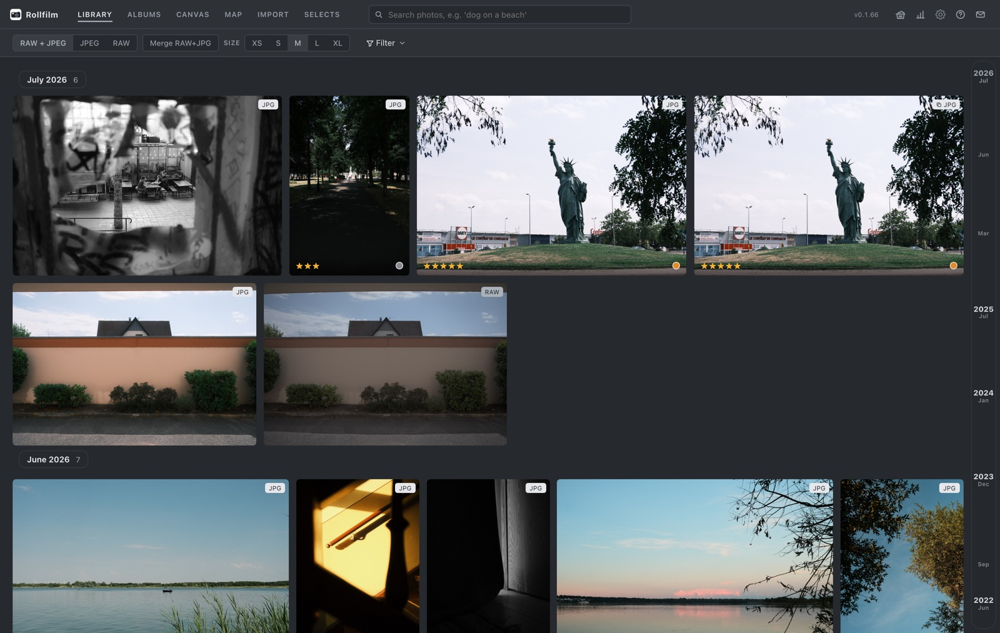
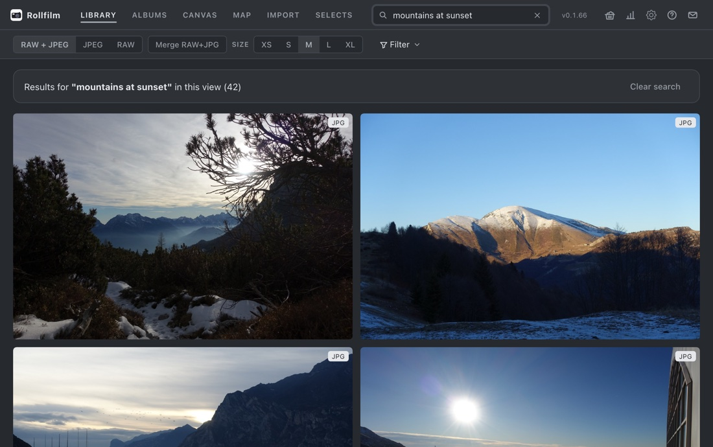
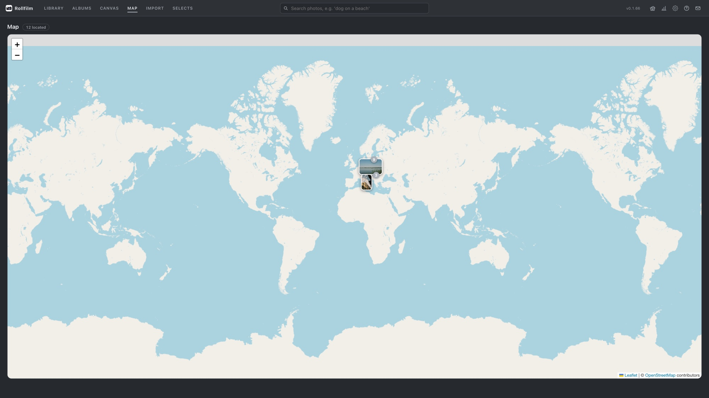
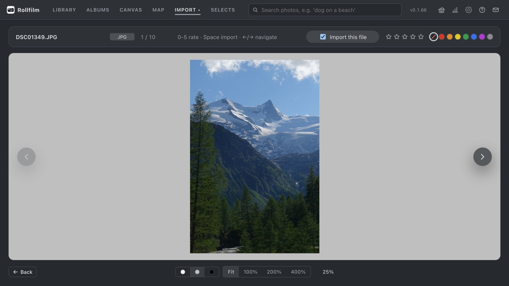
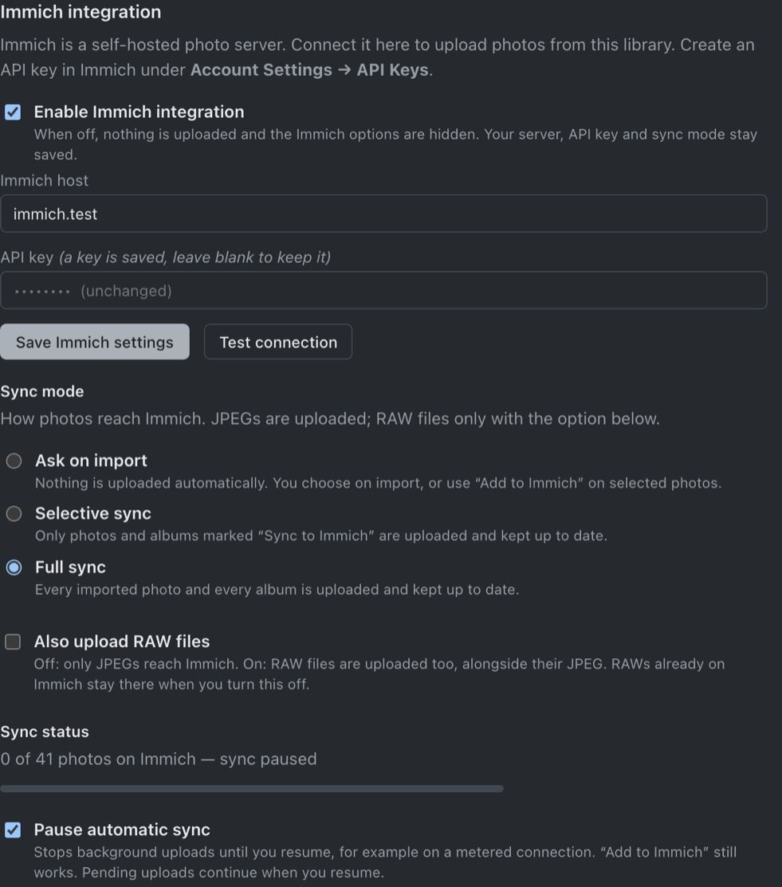
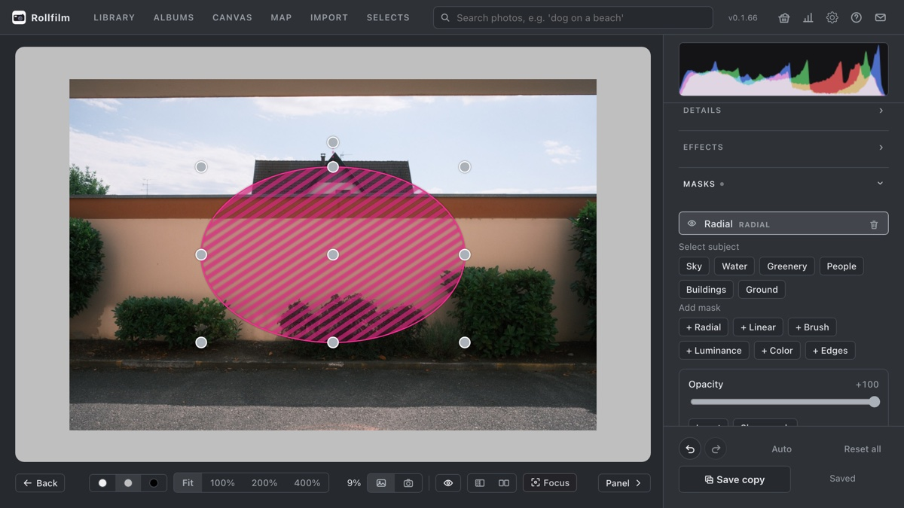
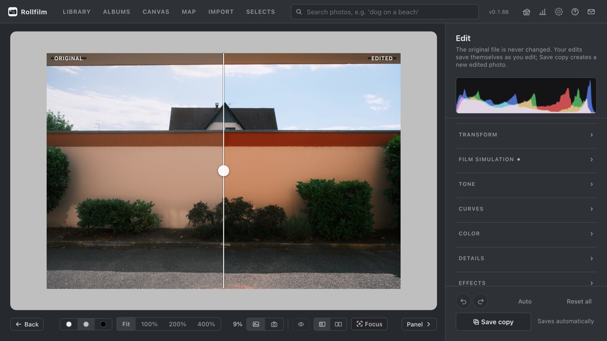
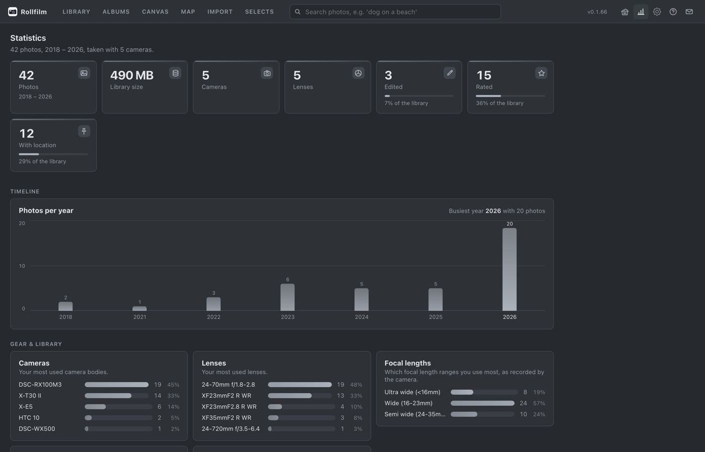
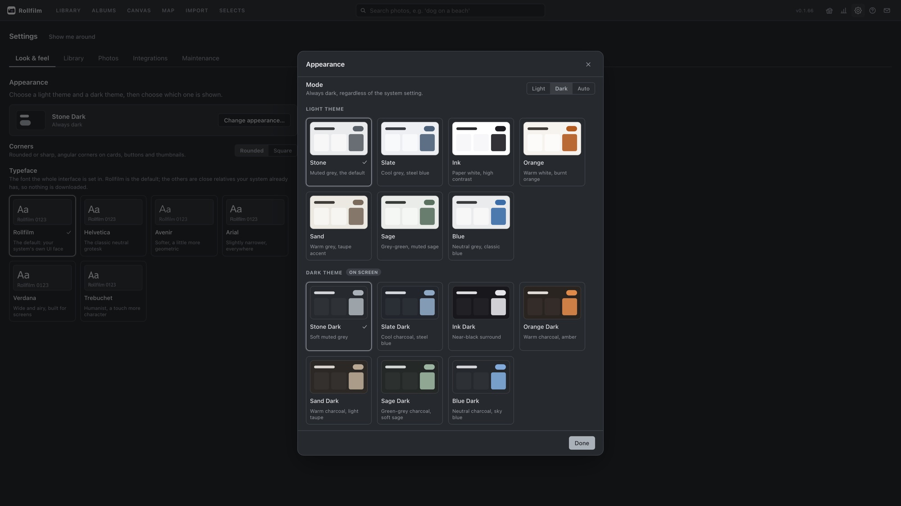

<div align="center">


# Rollfilm

**From memory card to finished photo. One app, on your own computer.**

Import, cull, search and edit — the whole path in one window, with first-class
[Immich](https://immich.app) integration at the end of it.
Local AI search, map & timeline browsing, RAW support.
No account, no cloud, no Docker, no setup.

[](https://github.com/pasqualkreher/Rollfilm/releases/latest)
[](https://github.com/pasqualkreher/Rollfilm/releases)
[](LICENSE)
[](#download--installation)

**[rollfilm.org](https://rollfilm.org)** · [Download](#download--installation) · [Screenshots](#screenshots) · [Features](#features) · [Contributing](CONTRIBUTING.md) · [FAQ](https://rollfilm.org/#faq)

<a href="https://rollfilm.org"></a>

</div>

Your photos stay on your own machine. Rollfilm imports them into a managed library, makes them searchable with natural language, and can optionally mirror your library to an existing Immich server.

> **Project status: work in progress.**
> This is an early but already very usable release that I wanted to share. The core — import pipeline, library organization, semantic search, and especially the Immich integration — works well. The built-in photo editor is experimental and should be seen as a fun extra rather than a finished feature (see [Photo editor](#photo-editor-experimental)).

## Who builds this, and how

Rollfilm is a **one-person hobby project**. There is no company behind it, no
team, no roadmap meeting — just me, my own photo library as the test case, and
whatever time is left over in the evening.

It is also **fully vibe coded**: essentially every line is written by an AI
assistant (Claude), with me directing, reviewing, testing and deciding what
ships. Every commit carries that in its trailer. I'm saying it plainly rather
than burying it, because you deserve to know what you are installing and because
it visibly shapes the code — you'll find long comments explaining *why* a
three-line function exists, which is how the reasoning survives between sessions.

What that means in practice:

- **It's tested where it counts.** 220+ backend tests cover the paths that could
  lose your photos or your edits — import, trash, pairing, library sync. Your
  originals are never modified; edits live in the database beside them.
- **It also means one person's blind spots.** Rollfilm is used daily on one
  library, one camera bag, one operating system more than the others. Bug
  reports from a different setup are genuinely the most useful thing you can
  send.
- **Keep a backup.** That is true of any photo manager, and I'd rather say it out
  loud than have you assume otherwise.

If that trade sounds fine to you, welcome. If not, that's a reasonable call too.

## Screenshots

More on [rollfilm.org](https://rollfilm.org/#screenshots).

| | |
| :---: | :---: |
| <br>**Semantic search** — describe what you remember | <br>**Map view** — every geotagged photo |
| <br>**Import wizard** — stage, compare, pick | <br>**Immich sync** — your library, mirrored |
| <br>**Editor** — non-destructive, masks, film sims | <br>**Compare** — split by a draggable line, or side by side |
| <br>**Statistics** — the gear you actually use | <br>**Skins** — a light one, a dark one, or follow the system |

## Features

### Library & import
- **Staged import wizard** — photos are copied at the speed of the media, reviewed in a virtualized grid that stays responsive at thousands of files, and analyzed in the background while you're already culling
- **RAW support** (via rawpy) with automatic RAW+JPEG pairing
- **EXIF extraction** (ExifTool) — capture date, camera, **lens**, exposure data — and reverse geocoding of GPS coordinates to country/place
- **Duplicate detection** during import — byte-identical files only, so a burst or a bracketed set comes in complete
- **Import a second library** — take a small drive travelling, cull the trip on it, and fold it into your main library at home *with* the stars, colour labels, edits, tags and albums you gave the photos on the road
- Albums, smart albums, tags (with bulk tagging), star ratings, color labels, and a selects/picks workflow
- **Rename photos from the app** — the file on disk is renamed with them, the RAW/JPEG partner follows to the same name, and the photo keeps its stars, tags, albums, edits and cached previews
- **Free-text descriptions** per photo, stored in the database like every other edit
- **Renames survive Finder** — a photo you rename or move outside the app is matched back by its content, not its name, so it keeps everything you gave it instead of being treated as deleted
- **Trash** with configurable retention and automatic background purge — a deletion keeps the photo's stars, tags, albums and edits, and Restore brings it all back
- **Backup & restore** — one zip with every photo plus all ratings, colors, albums, tags and edits, and a one-click "sync database to library" repair

### Search & browsing
- **Semantic search** — describe what you're looking for in natural language ("sunset at the beach", "dog in the snow"). Powered by CLIP embeddings stored in SQLite via `sqlite-vec`, fully local, no cloud API
- Image-to-image similarity search
- **Gear-aware filters** — narrow the library by camera, lens or a focal-length range slider; the filter options cross-filter each other (pick a camera and the lens list shrinks to what that camera actually shot), and the filter bar can be **pinned open** so it stays put while you cull
- **Map view** (Leaflet) of all geotagged photos
- **A timeline that stays out of the way at any size** — the whole library is laid out up front, so the scrollbar is exact from the first frame and the date scrubber on the right lands anywhere in it instantly; only the tiles near the viewport are ever mounted
- **Details without leaving the grid** — hover a tile for an "i" that opens camera, lens, exposure, tags and albums beside it
- **Statistics** — photos per year, plus which camera bodies, lenses and focal-length ranges you actually shoot, how your ratings fall, and what the library is made of
- **Light & dark skins** — three restrained pairs (Graphite, Slate, Ink), a light one and a dark one chosen separately, with a Light / Dark / Auto switch that can follow the system

### Immich integration ⭐
This is one of the highlights of the project: keep your library mirrored to an existing [Immich](https://immich.app) server without giving up local-first management.

- Configure server URL + API key directly in the app (Settings → Immich) — nothing goes into config files
- **Three sync modes:**
  - `manual` — per-import checkbox and on-demand "Add to Immich" buttons
  - `selective` — only photos and albums you flag for sync
  - `full` — every photo and album is mirrored automatically
- **Background reconciliation loop** — runs at startup and every 60 seconds: uploads missing assets, backfills asset IDs (checksum-based, so Immich deduplicates correctly), mirrors app albums to Immich albums, and propagates deletions through a durable pending-deletion queue
- Per-image exponential backoff on failures; event-driven uploads for instant sync after import
- Immich mirrors only your *visible* library — the local library always remains the recoverable source of truth

### External sources
- **Index photo collections in place** (e.g. a NAS) — read-only, without copying anything into the managed library
- Browse any mounted drive directly from the app

### Photo editor (experimental)
A non-destructive editor is included, but consider it a gimmick for now — it's fun to play with, not a Lightroom replacement.

- All rendering happens **in the app's backend**, so the live preview is pixel-identical to the exported result
- Edits are stored as values in the database; originals are never touched
- Exposure/contrast/highlights/shadows, white balance, HSL color mixer, color grading wheels, crop/rotate/perspective, and effects like grain, vignette, clarity, film-style diffusion and a white matte frame
- **Tone curves drawn over the photo's own histogram**, with a targeted picker: point at something in the image and drag to move the curve where that tone actually lives
- **Masks** — radial, linear, brush, luminance and color, plus **AI subject selection** (sky, water, greenery, people, buildings, ground) run locally with SegFormer. Point at a mask in the list and it marks what it covers
- **Compare against the original** — split by a divider you drag across the photo, or the two side by side. On a RAW the original half is shown with the library's auto-exposure, so the comparison isn't just "the edit is brighter"
- **Auto develop** — an optional "Auto" button that suggests develop settings *learned from your own edits*: a local CLIP k-nearest-neighbor recommender finds the photos you've already edited that look most like the one you're working on and blends their settings. No training step, no cloud — every edit you save immediately makes the next suggestion better. Works on a single photo or a whole selection at once

## Download & installation

Prebuilt installers for macOS, Windows, and Linux are on the [Releases page](https://github.com/pasqualkreher/Rollfilm/releases/latest) and on [rollfilm.org](https://rollfilm.org/#download).

| Platform | File | Notes |
| --- | --- | --- |
| macOS (Apple Silicon) | `Rollfilm-<version>-arm64.dmg` | See [macOS first launch](#macos-first-launch) below — the app is not code-signed yet. |
| Windows | `Rollfilm Setup <version>.exe` | SmartScreen may warn about an unknown publisher — choose **More info → Run anyway**. |
| Linux | `Rollfilm-<version>.AppImage` | Make it executable (`chmod +x Rollfilm-*.AppImage`) and run it. |

On first start the app downloads the CLIP model for semantic search; after that everything works offline.

Updates install themselves: the app checks the Releases page, downloads a new version in the background and applies it on the next quit.

### macOS first launch

The app is not notarized with Apple (no paid developer certificate), so Gatekeeper will block it with a "damaged or unverified" warning. After dragging Rollfilm into `/Applications`, remove the quarantine flag once:

```bash
xattr -dr com.apple.quarantine "/Applications/Rollfilm.app"
```

Then start the app normally. Alternatively: right-click the app → **Open** → **Open** on the first launch.

## Tech stack

| Layer | Tech |
| --- | --- |
| Backend | Python 3.11+, FastAPI, SQLAlchemy 2.0, Alembic, SQLite + `sqlite-vec` |
| ML / imaging | OpenCLIP (ViT-B-32), Pillow, rawpy, OpenCV, ImageHash, ExifTool |
| Frontend | React 18, TypeScript, Vite, TanStack Query, Leaflet |
| Desktop | Electron 33 + electron-builder, backend bundled with PyInstaller |

Everything runs locally — the only network access is the initial CLIP model download and your own Immich server (if configured).

## Getting started (development)

Rollfilm is a native desktop app (Electron). You need Node.js 18+, a Python 3.11+ that can load SQLite extensions (on macOS use Homebrew Python — the system build has extension loading compiled out and `sqlite-vec` will fail), and ExifTool on your `PATH` (the packaged app ships its own; development does not).

```bash
# Development (Vite dev server + Electron)
cd electron
npm install
npm run dev

# Build installers (dmg / nsis / AppImage)
npm run dist
```

There is also a GitHub Actions workflow ([.github/workflows/build-desktop.yml](.github/workflows/build-desktop.yml)) that builds macOS, Windows, and Linux installers, and a one-command local build (`node build-desktop.js`).

### Backend standalone (development)

```bash
cd backend
python -m venv .venv && source .venv/bin/activate
pip install -e ".[dev]"
python run_server.py   # runs Alembic migrations, then starts the API on localhost
pytest                 # 220+ tests, in-memory database, a few seconds
```

Thinking about contributing? [CONTRIBUTING.md](CONTRIBUTING.md) covers what is likely to be accepted, the commit style, and what to run before opening a pull request.

## Configuration

The desktop app configures itself (data directory, ports) and stores everything under your user data folder. The Immich server URL and API key are deliberately **not** environment variables: they are entered in the app under Settings → Immich integration and stored in the database. For backend development, `PM_DATA_DIR` overrides where the library/database live.

## Architecture

```
rollfilm/
├── backend/          FastAPI app
│   └── app/
│       ├── api/      REST routes (images, albums, import, search, tags, ...)
│       ├── services/ Domain logic (immich sync, import pipeline, embeddings,
│       │             thumbnails/editor rendering, EXIF, geocoding, trash, ...)
│       ├── workers/  Background queue (embeddings, Immich uploads)
│       └── db/       SQLAlchemy models + Alembic migrations
├── frontend/         React UI (talks to the backend via REST)
└── electron/         Desktop shell (spawns the bundled backend as a child process)
```

Notable design decisions:
- **Single local user, no auth** — this is a personal desktop app. The bundled backend listens on localhost for the app's own UI; don't expose it to a network as-is (CORS is wide open for localhost use).
- External sources are mounted **read-only** — the app can never modify your originals.
- Database migrations run automatically on startup, with retry logic for external drives.
- Handles cloud-synced folders (iCloud/Nextcloud placeholder files) and exFAT/NTFS drives.

## Known limitations

- The photo editor is experimental (see above)
- **Single user, no authentication** — the backend binds to localhost for the app's own window. Don't put it on a network as-is. If you want accounts and a server, that's a separate build: [rollfilm-hosted](https://github.com/pasqualkreher/rollfilm-hosted)
- **Not code-signed or notarized** — hence the one-time Gatekeeper and SmartScreen steps above. A matter of certificate cost, not of anything being wrong with the build
- The UI is only really exercised on macOS; Windows and Linux get less day-to-day use

## Contributing

Issues and pull requests are welcome — please read [CONTRIBUTING.md](CONTRIBUTING.md) first. The short version: open an issue before building anything big, run `pytest` and the frontend typecheck before opening a PR, and expect replies to take a few days.

- [Report a bug or request a feature](https://github.com/pasqualkreher/Rollfilm/issues/new/choose)
- [Ask a question](https://github.com/pasqualkreher/Rollfilm/discussions) — or see [SUPPORT.md](SUPPORT.md)
- [Report a security problem privately](SECURITY.md) — never as a public issue
- [Code of Conduct](CODE_OF_CONDUCT.md)

## Support the project

Rollfilm is free and open source, built in my spare time. If it's useful to you, a star on GitHub or a mention to a friend already helps. More on [rollfilm.org](https://rollfilm.org/#about).

## License

[MIT](LICENSE) — © Pasqual Kreher. You're free to use, modify, and redistribute this software; the copyright notice must be preserved.
